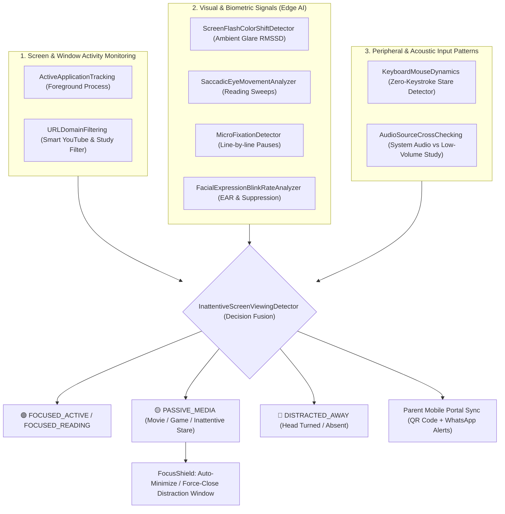

# 🧠 FlowState StudyGuard: Multi-Modal Biometric Focus & Inattentive Screen Viewing Defense

[](https://www.python.org/)
[](https://opensource.org/licenses/MIT)
[](tests/)
[](#-alignment-with-un-sdg-9-industry-innovation--infrastructure)

> **A 100% local edge-computing AI system that solves the "Inattentive Screen Viewing" problem in digital learning through multi-modal behavioral analysis, real-time parent sync, and zero cloud data transmission.**

---

## 🎯 The Core Problem: The Inattentive Screen Viewing Paradox

When a student stares directly at their monitor while watching a movie, streaming YouTube entertainment, or playing video games, conventional gaze-tracking and head-pose algorithms naively classify them as **"100% Attentive"**.

Standard single-modal computer vision models only ask: *"Is the face oriented toward the screen?"*  
They fail completely when students engage in **passive entertainment consumption**.

---

## 🛡️ The Multi-Modal StudyGuard Architecture

FlowState StudyGuard replaces naive single-modal gaze estimation with a three-pillar behavioral fusion engine:



### 1. Screen & Window Activity Monitoring
- **`ActiveApplicationTracking`**: Real-time Windows API process inspector (`GetForegroundWindow`, `QueryFullProcessImageNameW`) that flags entertainment executables (`vlc.exe`, `steam.exe`, `spotify.exe`, `discord.exe`, games).
- **`URLDomainFiltering`**: Smart content classifier distinguishing educational YouTube lectures (`Calculus`, `CS50`, `Physics Wallah`, `Khan Academy`) from entertainment videos (`MrBeast`, music videos, gaming streams, and YouTube Shorts).

### 2. Visual & Biometric Signals (Camera Analysis)
- **`ScreenFlashColorShiftDetector`**: Quantifies Root-Mean-Square Successive Difference (RMSSD) of facial luminance. Rapid scene transitions and explosions in movies/games trigger high volatility ($RMSD > 3.8$), while static study documents (PDFs, code) maintain steady ambient illumination ($RMSD < 1.0$).
- **`SaccadicEyeMovementAnalyzer` & `MicroFixationDetector`**: Differentiates rhythmic horizontal reading sweeps with micro-fixations from smooth object tracking or stationary movie staring.
- **`FacialExpressionBlinkRateAnalyzer`**: Computes Eye Aspect Ratio (EAR) and rolling Blinks Per Minute (BPM) to detect dopamine-driven blink rate suppression ($< 6\text{ BPM}$) typical of video gaming and film watching.

### 3. System & Peripheral Input Patterns
- **`KeyboardMouseDynamics`**: Evaluates system idle latency via Windows `GetLastInputInfo`. Identifies prolonged zero-input intervals alongside persistent screen gaze.
- **`AudioSourceCrossChecking`**: Cross-verifies active audio playback with recognized educational contexts.

---

## 🌍 Alignment with UN SDG 9: Industry, Innovation & Infrastructure

FlowState StudyGuard directly addresses **United Nations Sustainable Development Goal 9 (Build resilient infrastructure, promote inclusive and sustainable industrialization and foster innovation)**:

### 1. Target 9.c: Universal, Affordable & Equitable Digital Learning Infrastructure
- **Zero Cloud Dependence**: The entire biometric and multi-modal pipeline runs completely on-device (Edge AI). It does not require high-speed broadband, expensive cloud API tokens, or server farms.
- **Socio-Technical Accessibility**: Students in rural or bandwidth-constrained regions with low-spec hardware can run real-time focus monitoring without streaming raw video over cellular networks.

### 2. Target 9.5: Upgrading Technological Capabilities in Digital Wellbeing
- **Data Sovereignty & Privacy by Design**: Zero webcam frames or keystrokes ever leave the local machine. By ensuring strict local data encapsulation, FlowState bridges student privacy rights with parent transparency.
- **Resilient Cyber-Physical Architecture**: Low-latency, high-throughput model execution (~1.4 ms per inference cycle) guarantees that digital wellbeing infrastructure operates efficiently on consumer laptops.

---

## ⚡ Empirical Efficiency & Benchmark Results

Automated profiling was executed via `benchmark.py` across multiple frame resolutions and batch sizes:

| Batch Size | Resolution | Mean Latency (ms) | P95 Latency (ms) | Throughput (FPS) | Peak RAM (MB) |
|:---:|:---:|:---:|:---:|:---:|:---:|
| **1** | 640x480 (480p) | **1.38 ms** | 1.66 ms | **723.2 FPS** | **0.99 MB** |
| **1** | 1280x720 (720p) | **1.55 ms** | 1.91 ms | **646.5 FPS** | 4.62 MB |
| **1** | 1920x1080 (1080p) | **1.52 ms** | 1.82 ms | **656.9 FPS** | 9.67 MB |
| **4** | 640x480 (480p) | **1.50 ms** | 1.95 ms | **664.3 FPS** | 3.63 MB |
| **8** | 640x480 (480p) | **1.53 ms** | 2.00 ms | **653.7 FPS** | 7.15 MB |
| **16** | 640x480 (480p) | **1.61 ms** | 2.29 ms | **619.3 FPS** | 14.18 MB |

*Tested on Python 3.13 with native Ctypes and NumPy SIMD optimization. Full raw output exported to `benchmark_results.json`.*

---

## 🧪 Automated Test Suite (Pytest)

The repository includes a comprehensive 31-test suite with parameterized fixtures in [`tests/`](tests/):

```bash
.\flowstate\Scripts\pytest.exe -v
```

### Verified Test Categories:
- **`tests/test_biometrics.py`**: Asserts tensor shapes `(480, 640, 3)`, boundary handling on empty/corrupted frames, EAR calculation bounds, luminance RMSSD, and saccadic sweep patterns.
- **`tests/test_shield_and_youtube.py`**: Asserts Smart YouTube domain filtering across 12 parameterized scenarios (educational vs. entertainment/shorts), and whitelist protection.
- **`tests/test_multimodal_fusion.py`**: Asserts decision matrix under extreme head ratios, absent faces, and peripheral input transitions.
- **`tests/test_parent_and_hygiene.py`**: Asserts QR code PNG Base64 integrity, local IP parsing, WhatsApp URL encoding, and `.env.example` configuration hygiene.

---

## 🚀 Quick Start Guide

### 1. Installation
Clone the repository and install requirements:
```bash
python -m venv flowstate
.\flowstate\Scripts\activate
pip install -r requirements.txt  # Or: pip install streamlit mediapipe opencv-python numpy qrcode pytest
```

### 2. Configuration
Copy the template configuration:
```bash
copy .env.example .env
```

### 3. Run Benchmark
Execute empirical latency & memory profiling:
```bash
python benchmark.py
```

### 4. Run Automated Tests
```bash
pytest -v
```

### 5. Launch FlowState Application
```bash
streamlit run app.py
```

---

## 📱 Parent Mobile Integration
1. Scan the **QR Code** displayed in the app sidebar with any phone camera on the home Wi-Fi network.
2. Open `http://<local-ip>:8501?view=parent` directly in mobile Safari or Chrome.
3. Watch the live study countdown, focus score, and send instant encouragement nudges (`👏 Keep going!`).
